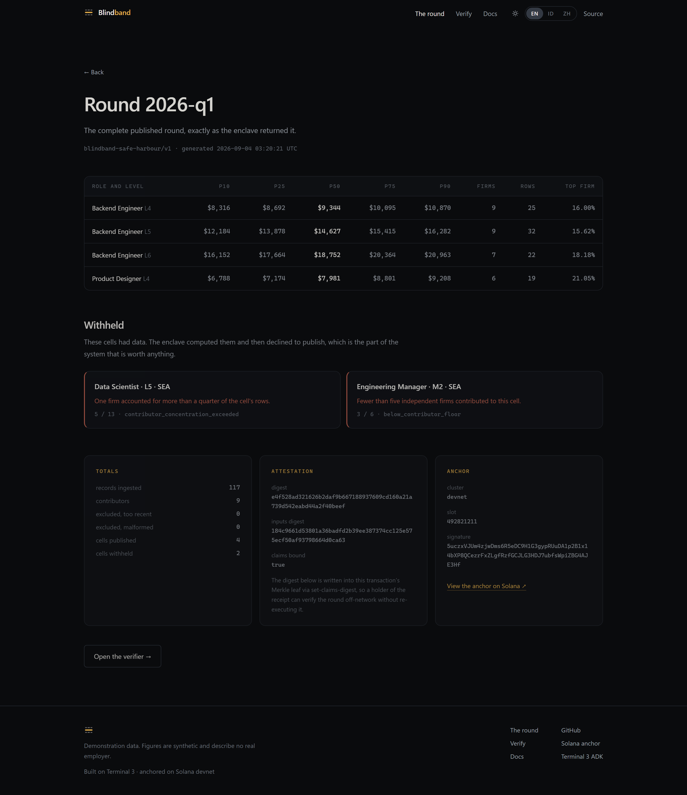
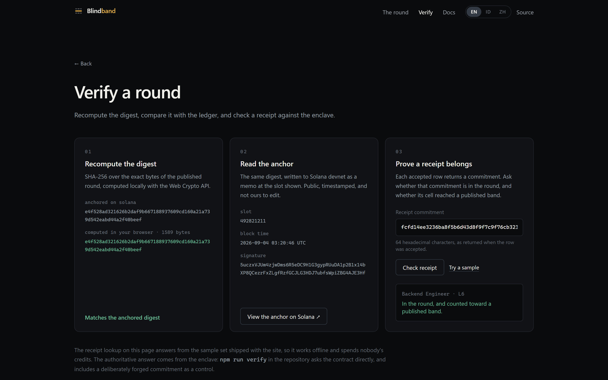
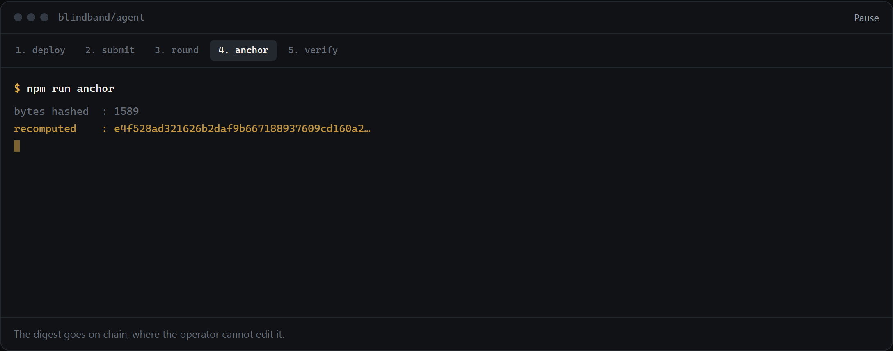
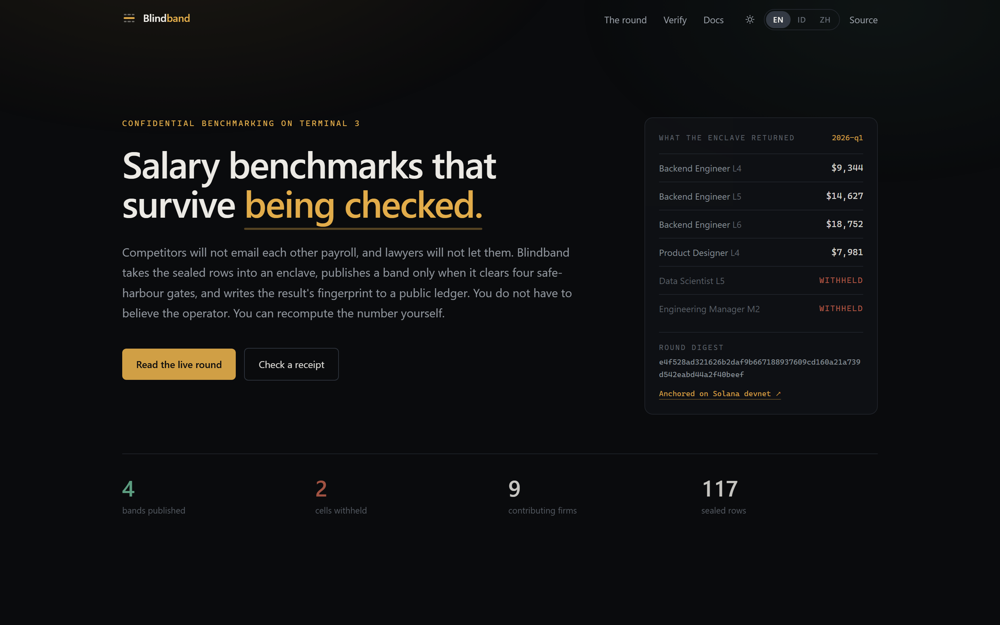
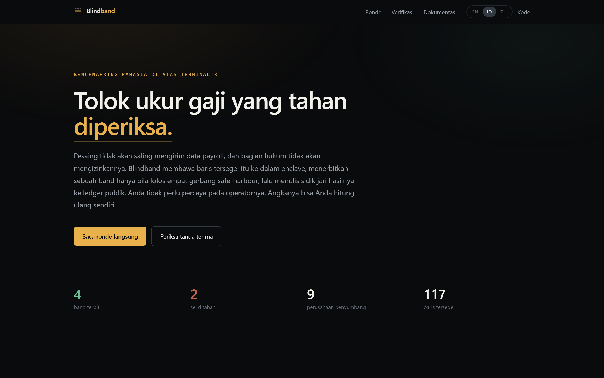
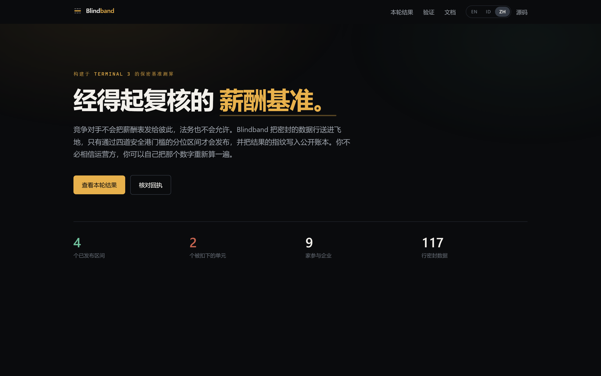
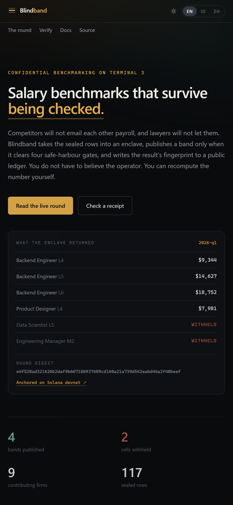
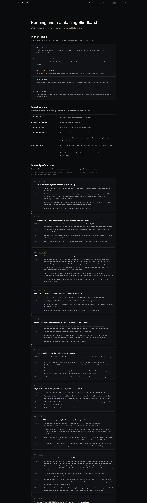

# Blindband — Terminal 3 ADK submission

**Confidential pay benchmarking in a TEE, with the result anchored on Solana.**

| | |
|---|---|
| Repository | https://github.com/bryankwandou/blindband |
| Live site | https://blindband.vercel.app (English · Bahasa Indonesia · 中文) |
| Mirror | https://bryankwandou.github.io/blindband — same commit, static export |
| Demo video | https://blindband.vercel.app/demo/blindband-demo.mp4 — 63 s, silent, captions on screen |
| Tenant DID | `did:t3n:efd91540b28ceaccc876f9d1603d3f7f0d91d64d` |
| Contract | `z:efd91540…d91d64d:blindband` v0.2.0, id 871 |
| Round | `2026-q1`, run 4 September 2026 on the sandbox |
| Digest | `e4f528ad321626b2daf9b667188937609cd160a21a739d542eabd44a2f40beef` |
| Solana anchor | [`5uczxVJU…AJE3Hf`, devnet, slot 492821211](https://explorer.solana.com/tx/5uczxVJUm4zjwDms6R5eDC9H1G3gypRUuDA1p2B1x14bXP8QCezrFxZLgfRzfGCJLG3HDJ7ubfsWpiZBG4AJE3Hf?cluster=devnet) |
| Continue or hand over | I would like to keep running it — see the last section |

---

## 1. The problem this agent is for

A group of firms wants to know what the market pays for a role. None will hand
its payroll to a competitor, and none may lawfully swap *current* pay figures
directly. The standard answer is a survey vendor: everyone mails a spreadsheet,
the vendor promises confidentiality, and a PDF comes back months later. The
members cannot see what happened in between, and neither can their regulators.

The rule that actually matters — that a benchmark must not become a channel for
competitors to read each other's current pay — is enforced by nothing but an
assurance. Competition authorities are specific about when such an exchange is
defensible: a **neutral aggregator**, **historical data**, **enough independent
contributors**, and **no single contributor dominating** the statistic.

Blindband turns those four conditions into code that runs where nobody can
watch it, and then publishes evidence that it did.

This is a real enterprise workflow with a real compliance constraint, which is
why it was chosen over the obvious demo shapes. It is deliberately not another
policy gateway or generic "private data" wrapper.

## 2. What the enclave actually did

Round `2026-q1`: 117 rows from 9 firms, submitted in a single execution.



**Published — 4 cells**

| Cell | P10 | Median | P90 | Firms | Rows | Top firm |
|---|---:|---:|---:|---:|---:|---:|
| Backend engineer L4 | $8,316 | $9,344 | $10,870 | 9 | 25 | 16.00% |
| Backend engineer L5 | $12,184 | $14,627 | $16,282 | 9 | 32 | 15.62% |
| Backend engineer L6 | $16,152 | $18,752 | $20,963 | 7 | 22 | 18.18% |
| Product designer L4 | $6,788 | $7,981 | $9,208 | 6 | 19 | 21.05% |

**Withheld — 2 cells, on two different gates**

| Cell | Reason | Firms / rows |
|---|---|---|
| Data scientist L5 | `contributor_concentration_exceeded` | 5 / 13 |
| Engineering manager M2 | `below_contributor_floor` | 3 / 6 |

The withheld cells are the point. Both had enough data to compute; the enclave
computed them and then declined to emit the numbers. One failed the
concentration ceiling, the other the contributor floor — so the demonstration
shows two independent gates firing rather than one rule repeated.

## 3. The four gates

Compiled into the contract as constants, named in every published round.

| Gate | Rule | Where |
|---|---|---|
| Neutral aggregator | No member sees another's rows | `ledger.rs` — the map ACL names the contract identity alone; no function returns a row |
| Historical data | Effective date ≥ 91 days old | `MIN_DATA_AGE_SECS` |
| Contributor floor | ≥ 5 firms and ≥ 10 rows per cell | `MIN_CONTRIBUTORS_PER_CELL`, `MIN_RECORDS_PER_CELL` |
| Concentration ceiling | No firm above 25% of a cell | `MAX_CONTRIBUTOR_SHARE_BPS` |

Blindband is engineering, not legal advice. The gates follow published
safe-harbour guidance; fit to a specific consortium is a question for counsel.

## 4. Verification — three tiers of trust

Anyone can check the round, and two of the three checks need nothing from us.



1. **Offline.** SHA-256 over the exact bytes of the published round. The site
   does this in the visitor's own browser with the Web Crypto API; the CLI does
   it in `agent/src/lib/digest.ts`. Both hash the `round` value sliced verbatim
   out of the response — a value that has been through `JSON.parse` and back is
   not the same bytes and would not match.
2. **On chain.** The same digest, written to Solana devnet as an SPL Memo. This
   gives the round an independent timestamp and an append-only history, so
   republishing a different round under the same id becomes obvious rather than
   impossible.
3. **Enclave.** `verify-receipt` asks the contract whether a commitment is in
   the ledger and whether its cell reached a published band. `npm run verify`
   runs three probes: one receipt in a published band, one in a withheld cell,
   and **one forged commitment as a negative control** — because a verifier that
   only ever says yes has not been shown to distinguish anything.

All eight checks passed:

```
1. offline — digest over the bytes on disk
[  ok  ] digest e4f528ad321626b2… over 1589 bytes matches the attestation

2. chain — the anchor on Solana devnet
     slot 492821211, block time 2026-09-04T03:20:44.000Z
[  ok  ] on-chain digest matches the round on disk
[  ok  ] anchor names round 2026-q1
[  ok  ] anchor names ruleset blindband-safe-harbour/v1
[  ok  ] anchor carries 4 published / 2 withheld

3. enclave — receipt inclusion, asked of the contract
[  ok  ] receipt in a published band → included true, counted true
[  ok  ] receipt in a withheld cell  → included true, counted false
[  ok  ] forged commitment           → included false

verdict     : every check passed.
```

## 5. The walkthrough

The site replays the five real commands rather than embedding a screen
recording — the transcript can be paused on the line you care about, the text
can be selected, and it does not go stale when an output string changes.



```bash
npm run deploy                        # register + scope the sealed maps
npm run submit -- data/records.json   # 117 rows, one execution
npm run round -- 2026-q1              # aggregate inside the enclave
npm run anchor                        # write the digest to Solana devnet
npm run verify                        # check all of the above
```

Each step refuses to proceed if the previous left something inconsistent.
`anchor` recomputes the digest locally and will not write to the chain if it
does not match — anchoring an unverified digest would put a number on a public
ledger and call it proof.

There is also a 63-second video, in `video/` as Remotion compositions and
served at
[`/demo/blindband-demo.mp4`](https://blindband.vercel.app/demo/blindband-demo.mp4).
It is silent and captioned on screen, and every figure in it — the firm count,
the bands, the withheld reasons, the digest, the slot — is read from the same
two data files the site reads. `npm run render` in `video/` rebuilds it, so a
number in the video cannot drift from the round it claims to show.

## 6. Ease of maintenance

This was the judging criterion the design was actually organised around.

- **The interesting logic runs without the platform.** `stats.rs` and
  `policy.rs` are pure and unit-tested; `cargo test` runs 23 tests on the host
  toolchain in under a second, with no node, no enclave and no credits. Only
  `ledger.rs` touches the host, and it is `wasm32` only.
- **Deploy is idempotent and self-healing.** `npm run deploy` tracks every
  contract id the tenant has registered and re-scopes both map ACLs to the
  union, so a version bump cannot orphan rows written by the previous build.
  This was a bug before it was a feature — see BB-03.
- **One state file.** `agent/state.json` holds the tenant DID, the contract
  ids and the map names. Nothing else lives outside git, and a single deploy
  reconstructs it.
- **Minimal capability surface.** `["kv_store", "logging", "tenant_context"]`.
  No `http`, so there is no egress to review or allowlist.
- **The reasoning is in the files.** Each module's header explains why it works
  the way it does — particularly the two places where the obvious approach is
  wrong (session vs. flat invoke, and writing the round verbatim).
- **The site is static.** Three locales, fifteen prerendered pages, no runtime
  backend, no API route that could be drained of test credits by a crawler.
- **It is not tied to one host.** The default build is the Vercel one; setting
  `BB_STATIC_EXPORT=1` produces a folder of files instead, which is what the
  GitHub Pages mirror serves from the same commit. Whoever inherits this is not
  inheriting a hosting account along with it.

## 7. The site

English is the default; Bahasa Indonesia and 中文 are hand-written, not machine
-passed — "withheld" and "hidden" mean materially different things here.

| | |
|---|---|
|  |  |
|  |  |

Every figure on the site is read from the round file at build time. The chart
plots all cells on one axis and keeps the withheld ones in place — dropping
them would hide the most interesting thing the enclave did.

## 8. Bugs

Eight write-ups with symptom, cause, fix and cost are on
[the docs page](https://blindband.vercel.app/en/docs) and in
[`web/src/lib/bugs.ts`](../../web/src/lib/bugs.ts). Five are platform issues,
three are our own — kept in the report because pretending otherwise would make
the other five less credible.



### Platform

**BB-01 — the flat `invoke()` path rejects a sandbox-claimed API key.**
`invalid api key: malformed api key token`, for every request regardless of
body or headers. `invoke()` expects an opaque `t3n_key_…` from organisation
agent provisioning; a key claimed from the community sandbox page is a hex
secp256k1 key for the SIWE session flow. The error names neither. *Fix:* use
`tenant.contracts.execute()`. *Cost:* about half a day, most of it spent
assuming the request body was wrong. **Suggested doc change:** the quickstart
should say which key type each dispatch path takes.

**BB-02 — the sandbox trust manifest does not parse, so attestation cannot be
verified.** `Trust manifest at https://cn-api.sg.testnet.t3n.terminal3.io/api/trust-manifest is malformed.`
The SDK then requires `T3N_ALLOW_UNVERIFIED_NODE=true`. The SDK's behaviour is
correct — it declines to trust a node it cannot attest. But the one property a
TEE platform sells is currently the property that cannot be checked on its own
sandbox. Every run in this repository prints the warning rather than hiding it.

**BB-03 — a KV map's ACL names contract *ids*, and a version bump mints a new
one.** After registering v0.2.0: `kv_store.get on 'z:…:bb-rounds' read denied:
access denied: TenantContract(did:t3n:…/871) cannot read map` — with an **empty
log ring**, because the contract dies during instantiation before it can log.
*Fix:* track every id and re-scope with `tenant.maps.update()`. *Cost:* the
longest single block of the build; the empty log is what made it expensive.
**Suggested doc change:** the KV maps guide should mention both the id coupling
and `maps.update()`.

**BB-04 — a map created without `readers` succeeds, then denies every read.**
The governor defaults to deny; an omitted `readers` set is a closed map, not an
open one. The failure surfaces far from the call that caused it.

**BB-05 — an execution locks 10,000,000,000 base units** against a
20,000,000,000 allocation, though a round settles at ~150,000,000. The lock is
a worst-case reservation, released on completion. It silently rules out the
obvious per-row API design — 117 rows one call at a time would need 117
executions. Worth stating on the test-tokens page, because it shapes the
contract interface, not just the budget.

### Ours

**BB-06 — the verifier could not read the anchor it had just written.**
`Memo on 5uczxVJU… is not a Blindband anchor`, reported against a transaction
that was one. SPL Memo v2 echoes the payload into the log as a JSON *string
literal*; slicing between the outer quotes leaves the escapes in. *Fix:* read
the decoded instruction data from `getParsedTransaction`, with a properly
unescaped log fallback. A false negative that looks exactly like tampering is
the worst failure mode a verification tool has.

**BB-07 — a byte-order mark in `state.json` silently re-registered the
contract.** `readState()` caught the parse failure and returned `{}`, so the
deploy believed nothing was registered. The deeper fix is that an unparseable
state file should stop the deploy rather than be treated as empty state.

**BB-08 — a default build target made `cargo test` impossible.**
`could not execute process … z_blindband-….wasm` / `%1 is not a valid Win32
application (os error 193)`. `.cargo/config.toml` set `[build] target =
"wasm32-wasip2"` to shorten the component build; that default applies to
`cargo test` too, so cargo compiled the test harnesses to wasm and then tried
to run them natively. *Fix:* drop the default and name the target on the one
command that needs it. Worth recording because the repository was claiming the
gates were covered by a command that did not run — found by executing every
command in our own documentation before publishing, which is the only reason it
is not still true.

## 9. Status, honestly

The pipeline is real and every number in this report came out of it. Two things
are open before anyone's actual payroll should go near it:

1. It runs on a **sandbox tenant with test credits**.
2. Rounds currently execute under the **tenant identity**, not a delegated
   agent key. The agent reports which identity ran a round rather than
   pretending it was the agent.

And BB-02 means attestation is currently unverifiable against the sandbox node.
That is a platform issue, but it is a load-bearing one for this product, so it
belongs in the summary rather than a footnote.

## 10. Continuing or handing over

**I would like to keep running it** and take it toward a consortium pilot —
the interesting work is signing up the first five firms and finding out where
the gates are wrong in practice, which needs an operator rather than a
maintainer.

If Terminal 3 would rather host it, the handover is small:

- The repository is self-contained: contract, agent and site in one tree.
- `npm run deploy` is idempotent and reconciles map ACLs on every run.
- The only state outside git is the tenant DID, the contract ids and the map
  names, all in `agent/state.json` and reproducible with a single deploy.
- Re-pointing at a different tenant is two environment variables.
- The pure logic is covered by `cargo test`, so a maintainer can change a gate
  and know within seconds whether they broke the percentile maths.

Happy to discuss the startup programme and listing page.
