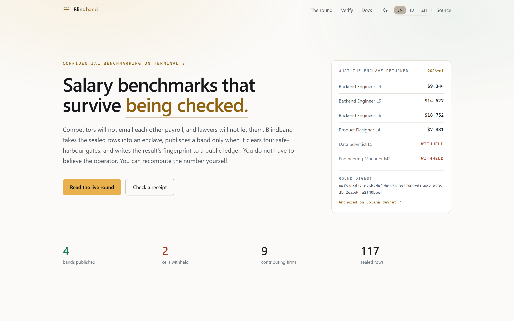
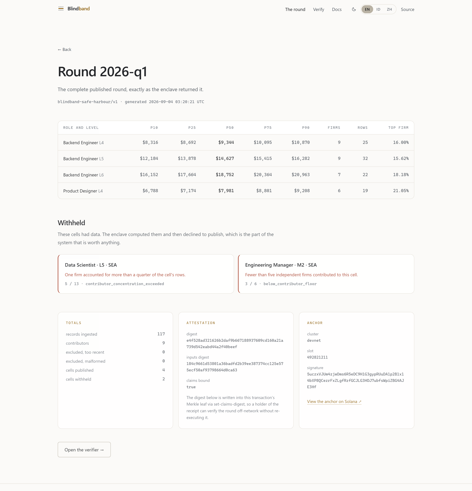

# Blindband — Terminal 3 ADK submission

**Confidential pay benchmarking in a TEE, with the result anchored on Solana.**

| | |
|---|---|
| Repository | https://github.com/bryankwandou/blindband |
| Live site | https://blindband.vercel.app (English · Bahasa Indonesia · 中文) |
| Mirror | https://bryankwandou.github.io/blindband — same commit, static export |
| Demo video | https://blindband.vercel.app/demo/blindband-demo.mp4 — 63 s, silent, captions on screen |
| Tenant DID | `did:t3n:efd91540b28ceaccc876f9d1603d3f7f0d91d64d` |
| Contract | `z:efd91540…d91d64d:blindband` v0.2.0, id 871 |
| Round | `2026-q1`, run 4 September 2026 on the sandbox |
| Digest | `e4f528ad321626b2daf9b667188937609cd160a21a739d542eabd44a2f40beef` |
| Solana anchor | [`5uczxVJU…AJE3Hf`, devnet, slot 492821211](https://explorer.solana.com/tx/5uczxVJUm4zjwDms6R5eDC9H1G3gypRUuDA1p2B1x14bXP8QCezrFxZLgfRzfGCJLG3HDJ7ubfsWpiZBG4AJE3Hf?cluster=devnet) |
| Continue or hand over | I would like to keep running it — see the last section |

---

## 1. The problem this agent is for

A group of firms wants to know what the market pays for a role. None will hand
its payroll to a competitor, and none may lawfully swap *current* pay figures
directly. The standard answer is a survey vendor: everyone mails a spreadsheet,
the vendor promises confidentiality, and a PDF comes back months later. The
members cannot see what happened in between, and neither can their regulators.

The rule that actually matters — that a benchmark must not become a channel for
competitors to read each other's current pay — is enforced by nothing but an
assurance. Competition authorities are specific about when such an exchange is
defensible: a **neutral aggregator**, **historical data**, **enough independent
contributors**, and **no single contributor dominating** the statistic.

Blindband turns those four conditions into code that runs where nobody can
watch it, and then publishes evidence that it did.

This is a real enterprise workflow with a real compliance constraint, which is
why it was chosen over the obvious demo shapes. It is deliberately not another
policy gateway or generic "private data" wrapper.

## 2. What the enclave actually did

Round `2026-q1`: 117 rows from 9 firms, submitted in a single execution.


**Published — 4 cells**

| Cell | P10 | Median | P90 | Firms | Rows | Top firm |
|---|---:|---:|---:|---:|---:|---:|
| Backend engineer L4 | $8,316 | $9,344 | $10,870 | 9 | 25 | 16.00% |
| Backend engineer L5 | $12,184 | $14,627 | $16,282 | 9 | 32 | 15.62% |
| Backend engineer L6 | $16,152 | $18,752 | $20,963 | 7 | 22 | 18.18% |
| Product designer L4 | $6,788 | $7,981 | $9,208 | 6 | 19 | 21.05% |

**Withheld — 2 cells, on two different gates**

| Cell | Reason | Firms / rows |
|---|---|---|
| Data scientist L5 | `contributor_concentration_exceeded` | 5 / 13 |
| Engineering manager M2 | `below_contributor_floor` | 3 / 6 |

The withheld cells are the point. Both had enough data to compute; the enclave
computed them and then declined to emit the numbers. One failed the
concentration ceiling, the other the contributor floor — so the demonstration
shows two independent gates firing rather than one rule repeated.

## 3. The four gates

Compiled into the contract as constants, named in every published round.

| Gate | Rule | Where |
|---|---|---|
| Neutral aggregator | No member sees another's rows | `ledger.rs` — the map ACL names the contract identity alone; no function returns a row |
| Historical data | Effective date ≥ 91 days old | `MIN_DATA_AGE_SECS` |
| Contributor floor | ≥ 5 firms and ≥ 10 rows per cell | `MIN_CONTRIBUTORS_PER_CELL`, `MIN_RECORDS_PER_CELL` |
| Concentration ceiling | No firm above 25% of a cell | `MAX_CONTRIBUTOR_SHARE_BPS` |

Blindband is engineering, not legal advice. The gates follow published
safe-harbour guidance; fit to a specific consortium is a question for counsel.

## 4. Verification — three tiers of trust

Anyone can check the round, and two of the three checks need nothing from us.


1. **Offline.** SHA-256 over the exact bytes of the published round. The site
   does this in the visitor's own browser with the Web Crypto API; the CLI does
   it in `agent/src/lib/digest.ts`. Both hash the `round` value sliced verbatim
   out of the response — a value that has been through `JSON.parse` and back is
   not the same bytes and would not match.
2. **On chain.** The same digest, written to Solana devnet as an SPL Memo. This
   gives the round an independent timestamp and an append-only history, so
   republishing a different round under the same id becomes obvious rather than
   impossible.
3. **Enclave.** `verify-receipt` asks the contract whether a commitment is in
   the ledger and whether its cell reached a published band. `npm run verify`
   runs three probes: one receipt in a published band, one in a withheld cell,
   and **one forged commitment as a negative control** — because a verifier that
   only ever says yes has not been shown to distinguish anything.

All eight checks passed:

```
1. offline — digest over the bytes on disk
[  ok  ] digest e4f528ad321626b2… over 1589 bytes matches the attestation

2. chain — the anchor on Solana devnet
     slot 492821211, block time 2026-09-04T03:20:44.000Z
[  ok  ] on-chain digest matches the round on disk
[  ok  ] anchor names round 2026-q1
[  ok  ] anchor names ruleset blindband-safe-harbour/v1
[  ok  ] anchor carries 4 published / 2 withheld

3. enclave — receipt inclusion, asked of the contract
[  ok  ] receipt in a published band → included true, counted true
[  ok  ] receipt in a withheld cell  → included true, counted false
[  ok  ] forged commitment           → included false

verdict     : every check passed.
```

## 5. The walkthrough

The site replays the five real commands rather than embedding a screen
recording — the transcript can be paused on the line you care about, the text
can be selected, and it does not go stale when an output string changes.


```bash
npm run deploy                        # register + scope the sealed maps
npm run submit -- data/records.json   # 117 rows, one execution
npm run round -- 2026-q1              # aggregate inside the enclave
npm run anchor                        # write the digest to Solana devnet
npm run verify                        # check all of the above
```

Each step refuses to proceed if the previous left something inconsistent.
`anchor` recomputes the digest locally and will not write to the chain if it
does not match — anchoring an unverified digest would put a number on a public
ledger and call it proof.

There is also a 63-second video, in `video/` as Remotion compositions and
served at
[`/demo/blindband-demo.mp4`](https://blindband.vercel.app/demo/blindband-demo.mp4).
It is silent and captioned on screen, and every figure in it — the firm count,
the bands, the withheld reasons, the digest, the slot — is read from the same
two data files the site reads. `npm run render` in `video/` rebuilds it, so a
number in the video cannot drift from the round it claims to show.

## 6. Ease of maintenance

This was the judging criterion the design was actually organised around.

- **The interesting logic runs without the platform.** `stats.rs` and
  `policy.rs` are pure and unit-tested; `cargo test` runs 23 tests on the host
  toolchain in under a second, with no node, no enclave and no credits. Only
  `ledger.rs` touches the host, and it is `wasm32` only.
- **Deploy is idempotent and self-healing.** `npm run deploy` tracks every
  contract id the tenant has registered and re-scopes both map ACLs to the
  union, so a version bump cannot orphan rows written by the previous build.
  This was a bug before it was a feature — see BB-03.
- **One state file.** `agent/state.json` holds the tenant DID, the contract
  ids and the map names. Nothing else lives outside git, and a single deploy
  reconstructs it.
- **Minimal capability surface.** `["kv_store", "logging", "tenant_context"]`.
  No `http`, so there is no egress to review or allowlist.
- **The reasoning is in the files.** Each module's header explains why it works
  the way it does — particularly the two places where the obvious approach is
  wrong (session vs. flat invoke, and writing the round verbatim).
- **The site is static.** Three locales, fifteen prerendered pages, no runtime
  backend, no API route that could be drained of test credits by a crawler.
- **It is not tied to one host.** The default build is the Vercel one; setting
  `BB_STATIC_EXPORT=1` produces a folder of files instead, which is what the
  GitHub Pages mirror serves from the same commit. Whoever inherits this is not
  inheriting a hosting account along with it.

## 7. The site

English is the default; Bahasa Indonesia and 中文 are hand-written, not machine
-passed — "withheld" and "hidden" mean materially different things here.

| | |
|---|---|
|  |  |
|  |  |
|  |  |

Every figure on the site is read from the round file at build time. The chart
plots all cells on one axis and keeps the withheld ones in place — dropping
them would hide the most interesting thing the enclave did.

The landing page opens on the round rather than on a claim about it: beside the
headline sits the enclave's own output — four medians, the two cells it refused
to publish, the digest, and the link to the anchor — so the first thing a
reader sees above the fold is the thing they are invited to check.

There are two themes. The site follows the reader's operating system on a first
visit and remembers an explicit choice after that, applied by an inline script
before first paint so nobody watches a dark page turn light. Every colour is a
role rather than a value — `ink` is the page ground in both themes — which is
why the swap is one stylesheet and not a second set of components. The light
palette was re-derived rather than inverted: the dark amber is 2.1:1 on white
and would have failed, so text amber, green and rust all have their own light
values, and every pair clears WCAG AA (ivory 17.0:1, quiet 7.5:1, faint 4.7:1,
signal 5.1:1, published 5.1:1, withheld 6.2:1).

## 8. Bugs

Twelve write-ups with symptom, cause, fix and cost are on
[the docs page](https://blindband.vercel.app/en/docs) and in
[`web/src/lib/bugs.ts`](../../web/src/lib/bugs.ts). Six are platform issues,
six are our own — kept in the report because pretending otherwise would make
the other six less credible.


### Platform

**BB-01 — the flat `invoke()` path rejects a sandbox-claimed API key.**
`invalid api key: malformed api key token`, for every request regardless of
body or headers. `invoke()` expects an opaque `t3n_key_…` from organisation
agent provisioning; a key claimed from the community sandbox page is a hex
secp256k1 key for the SIWE session flow. The error names neither. *Fix:* use
`tenant.contracts.execute()`. *Cost:* about half a day, most of it spent
assuming the request body was wrong. **Suggested doc change:** the quickstart
should say which key type each dispatch path takes.

**BB-02 — the sandbox trust manifest does not parse, so attestation cannot be
verified.** `Trust manifest at https://cn-api.sg.testnet.t3n.terminal3.io/api/trust-manifest is malformed.`
The SDK then requires `T3N_ALLOW_UNVERIFIED_NODE=true`. The SDK's behaviour is
correct — it declines to trust a node it cannot attest. But the one property a
TEE platform sells is currently the property that cannot be checked on its own
sandbox. Every run in this repository prints the warning rather than hiding it.

**BB-03 — a KV map's ACL names contract *ids*, and a version bump mints a new
one.** After registering v0.2.0: `kv_store.get on 'z:…:bb-rounds' read denied:
access denied: TenantContract(did:t3n:…/871) cannot read map` — with an **empty
log ring**, because the contract dies during instantiation before it can log.
*Fix:* track every id and re-scope with `tenant.maps.update()`. *Cost:* the
longest single block of the build; the empty log is what made it expensive.
**Suggested doc change:** the KV maps guide should mention both the id coupling
and `maps.update()`.

**BB-04 — a map created without `readers` succeeds, then denies every read.**
The governor defaults to deny; an omitted `readers` set is a closed map, not an
open one. The failure surfaces far from the call that caused it.

**BB-05 — an execution locks 10,000,000,000 base units** against a
20,000,000,000 allocation, though a round settles at ~150,000,000. The lock is
a worst-case reservation, released on completion. It silently rules out the
obvious per-row API design — 117 rows one call at a time would need 117
executions. Worth stating on the test-tokens page, because it shapes the
contract interface, not just the budget.

### Ours

**BB-06 — the verifier could not read the anchor it had just written.**
`Memo on 5uczxVJU… is not a Blindband anchor`, reported against a transaction
that was one. SPL Memo v2 echoes the payload into the log as a JSON *string
literal*; slicing between the outer quotes leaves the escapes in. *Fix:* read
the decoded instruction data from `getParsedTransaction`, with a properly
unescaped log fallback. A false negative that looks exactly like tampering is
the worst failure mode a verification tool has.

**BB-07 — a byte-order mark in `state.json` silently re-registered the
contract.** `readState()` caught the parse failure and returned `{}`, so the
deploy believed nothing was registered. The deeper fix is that an unparseable
state file should stop the deploy rather than be treated as empty state.

**BB-08 — a default build target made `cargo test` impossible.**
`could not execute process … z_blindband-….wasm` / `%1 is not a valid Win32
application (os error 193)`. `.cargo/config.toml` set `[build] target =
"wasm32-wasip2"` to shorten the component build; that default applies to
`cargo test` too, so cargo compiled the test harnesses to wasm and then tried
to run them natively. *Fix:* drop the default and name the target on the one
command that needs it. Worth recording because the repository was claiming the
gates were covered by a command that did not run — found by executing every
command in our own documentation before publishing, which is the only reason it
is not still true.

**BB-09 — `state.json` was committed, so the first command failed for everyone
but us.** A clean clone carried our tenant DID and contract ids 870/871.
Deploying with a different key printed `contract : reusing
z:efd91540…:blindband (id 871)` — a namespace that key does not own — registered
nothing, and scoped the new tenant's maps to `readers: { only: [870, 871] }`.
The first `submit` would then die with AccessDenied and an empty log ring: the
exact failure BB-03 exists to describe, re-inflicted on every reader by our own
packaging. *Fix:* untrack the file, and have the deploy compare
`state.tenantDid` against the DID it just connected as — foreign state is now
announced and discarded rather than used. An unparseable state file is fatal
too, which is the deeper fix BB-07 identified and did not make at the time.

**BB-10 — the sample data our own quickstart tells you to submit was not in the
repository.** `.gitignore` held `data/*.json` with a `!data/.gitkeep` exception,
and `.gitkeep` was never created, so git dropped the directory entirely.
`npm run submit -- data/records.json` referred to a file no clone contained.
*Fix:* ignore the four generated artefacts by name and track `records.json`; the
117 rows are synthetic, nine members named `member-01`…`member-09`.

Both were found the same way, and only that way: by cloning this repository from
GitHub into an empty directory and reading it as someone who had never seen it.
Everything had been tested on the machine that wrote it, where both files were
sitting on disk. That is worth stating plainly under a judging criterion about
maintenance — the repository claimed to be reproducible in three places while
being reproducible by nobody.

**BB-11 — a sandbox tenant cannot provision the delegated agent identity the
SDK offers it.** `client.createAgent(did, "blindband-round-runner")` is present
and callable, and on a sandbox-claimed DID it returns `RPC Error: organisation
has no policy meta`. *Cause:* `createAgent` expects an *organisation* DID whose
caller is an admin of it; a DID claimed from the community sandbox page is not
an organisation and carries no policy metadata. This is BB-01's tier boundary
seen from the other side — the opaque `t3n_key_…` that the flat `invoke()` path
demands is exactly what `createAgent` would have returned. *Fix:* none from this
tier. Rounds run under the tenant identity, and the report says so rather than
implying an agent key that does not exist. `npm run probe:agent` makes the call
in one command and prints whatever the platform answers, so the next person can
tell in seconds whether their tier has lifted. *Cost:* no lost time, but it is
the largest remaining gap between what this is and what an agent on this
platform is meant to be, and it is not closable by writing better code.


## 9. Trying it yourself

The reviewer should not have to take any of the above on trust, and does not
have to ask us for anything to avoid it. One command, no key, no credits, no
account:

```bash
git clone https://github.com/bryankwandou/blindband && cd blindband/agent
npm install
npm run judge
```

```text
round        : 2026-q1  (blindband-safe-harbour/v1)
submissions  : 117 rows, read from agent/data/records.json
rpc          : https://api.devnet.solana.com

[  ok  ] the gates and the maths, recomputed from the raw submissions
         70 fields agree — 4 cells published, 2 withheld (contributor_concentration_exceeded, below_contributor_floor)

[  ok  ] the digest, recomputed from the published bytes
         1589 bytes hashed → e4f528ad321626b2…2f40beef — the digest the enclave attested

[  ok  ] the digest, read back off Solana devnet
         tx 5uczxVJUm4zj… carries d=e4f528ad321626b2… for round 2026-q1,
         written at slot 492821211 — before you asked, and not by anything of ours

[  ok  ] the negative controls — a verifier that can say no
         one median raised by $0.01 → 843d5cdd8ecf6a87…, rejected
         one salary raised by $1.00 → recomputation diverges, rejected

──────────────────────────────────────────────────────────────────────
4/4 checks passed. The published round is the one the enclave
produced from these submissions, and the chain agrees.
```

The first check is the one that matters most and the one that took the most
care to make honest. `agent/src/lib/recompute.ts` is a **second implementation**
of the four gates and the percentile maths — written in TypeScript against
`policy.rs` and `stats.rs`, sharing no code with them. It reads the 117 raw
submissions, folds them into a round of its own, and diffs that against the
published round field by field: every percentile, every mean, every contributor
count, every top-contributor share, and both withholding reasons. Seventy
fields have to agree. A table of plausible-looking numbers typed in by hand
does not survive it, and neither would a subtle change to a gate threshold.

The fourth check exists for the opposite reason. A verifier that only ever
prints `ok` is worthless, and from the outside it looks identical to one that
works. So the harness tampers with its own inputs — one median raised by a
cent, one salary raised by a dollar — and requires both to be rejected before
it reports success.

### Running the agent, not just checking its homework

Verifying a past round is one thing; a reviewer is entitled to ask whether the
agent can be *used*. It can, on their own data, offline, with no account:

```bash
cd contract
cargo run --example replay -- examples/payroll-sample.csv --round-id demo
```

```text
ingested 30 rows from 5 contributors — 5 too recent, 0 malformed
1 cells published, 2 withheld

PUBLISHED
  cell                     cur          p10    median       p90  firms  top firm
  backend engineer l4      EUR      6916.00   7415.00   8009.00      5    25.00%

WITHHELD
  data scientist l5        contributor_concentration_exceeded     5 firms / 10 rows
  engineering manager m2   below_contributor_floor                3 firms / 3 rows
```

This is not a demonstration written to look like the enclave. It calls
`policy::aggregate` and `policy::round_digest` out of the same crate that was
compiled to `wasm32-wasip2` and registered as the component — the same code
paths, the same constants, the same gates. The enclave is what keeps the inputs
sealed from the other members; it does not get a vote on the arithmetic.

The sample file makes all four gates fire in one run, deliberately. The one
published cell sits at exactly 25.00% concentration — one row either way and it
is withheld. The five product designer rows never reach the maths, because
their pay is effective in 2030 and gate 1 drops anything less than 91 days old.

A reviewer can point it at their own extract instead. The header row is the
whole schema:

```text
contributor,role,level,region,currency,base_minor,effective_at
acme,Backend Engineer,L4,EU,EUR,720000,1755000000
```

Move a salary, remove a contributor, change a date, and watch cells stop being
publishable. That is the product argument, made on the reviewer's own numbers
rather than ours.

### Deriving the anchored digest on your own machine

The same command rebuilds the round that is on Solana:

```bash
cargo run --example replay -- --replay
```

```text
digest       : e4f528ad321626b2daf9b667188937609cd160a21a739d542eabd44a2f40beef
expected     : e4f528ad321626b2daf9b667188937609cd160a21a739d542eabd44a2f40beef

[  ok  ] this machine derived the digest that is anchored on Solana devnet.
         Same inputs, same code, same answer — no enclave, no key, no network.
```

`agent/data/receipts.json` is committed for this reason: the commitments it
holds are what allow the 117 submissions to be reconstructed exactly as the
ledger held them, rather than approximately. With them, a laptop with no
credentials derives `e4f528ad…beef` — the digest written to devnet on 4
September, in a transaction that predates the reviewer's interest in it.

The four checks in `npm run judge` show the published round is internally
consistent and that the chain agrees. This shows something stronger: the round
is *derivable*. Nothing about it has to be taken on our word, including the
claim that an enclave ran it.


### Reading the anchor without any of our code

Only the third check needs the internet, and it reaches a public Solana RPC
endpoint rather than anything we run. The same fact can be read with `curl` and
no code of ours at all:

```bash
curl -s -X POST https://api.devnet.solana.com -H 'Content-Type: application/json' \
  -d '{"jsonrpc":"2.0","id":1,"method":"getTransaction","params":["5uczxVJUm4zjwDms6R5eDC9H1G3gypRUuDA1p2B1x14bXP8QCezrFxZLgfRzfGCJLG3HDJ7ubfsWpiZBG4AJE3Hf",{"encoding":"jsonParsed","maxSupportedTransactionVersion":0}]}'
```

Or press the button on [`/en/verify`](https://blindband.vercel.app/en/verify),
where the digest is recomputed in the browser with the Web Crypto API.

The gates also carry their own unit tests, with no node and no JavaScript:

```bash
cd contract && cargo test     # 23 tests on the percentile maths and the four gates
```

Only the third tier — asking the enclave itself — needs a T3N key, because it
spends the reviewer's credits rather than ours:

```bash
cd agent && cp .env.example .env   # T3N_API_KEY, SOLANA_SEED_HEX
npm run deploy -- --dry-run        # free: names your tenant, prints your balance,
                                   # and says what the real deploy would do
npm run probe:agent                # free: asks whether your tier can hold an agent key
```

`--dry-run` exists because the first thing anyone inheriting this should be able
to do is confirm their credentials work without spending 10,000,000,000 base
units to find out. `probe:agent` is the same courtesy applied to BB-11: rather
than asking anyone to believe that delegated agent provisioning is unavailable
on the sandbox tier, it makes the call and prints whatever the platform says.

## 10. Status, honestly

The pipeline is real and every number in this report came out of it. Two things
are open before anyone's actual payroll should go near it:

1. It runs on a **sandbox tenant with test credits**.
2. Rounds currently execute under the **tenant identity**, not a delegated
   agent key. The agent reports which identity ran a round rather than
   pretending it was the agent.

And BB-02 means attestation is currently unverifiable against the sandbox node.
That is a platform issue, but it is a load-bearing one for this product, so it
belongs in the summary rather than a footnote.

## 11. Continuing or handing over

**I would like to keep running it** and take it toward a consortium pilot —
the interesting work is signing up the first five firms and finding out where
the gates are wrong in practice, which needs an operator rather than a
maintainer.

If Terminal 3 would rather host it, the handover is small:

- The repository is self-contained: contract, agent and site in one tree.
- `npm run deploy` is idempotent and reconciles map ACLs on every run.
- The only state outside git is the tenant DID, the contract ids and the map
  names, all in `agent/state.json` and reproducible with a single deploy.
- Re-pointing at a different tenant is two environment variables.
- The pure logic is covered by `cargo test`, so a maintainer can change a gate
  and know within seconds whether they broke the percentile maths.

Happy to discuss the startup programme and listing page.
